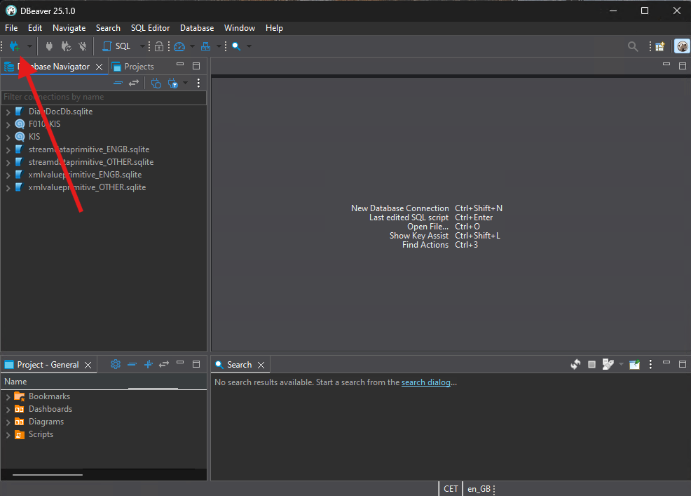
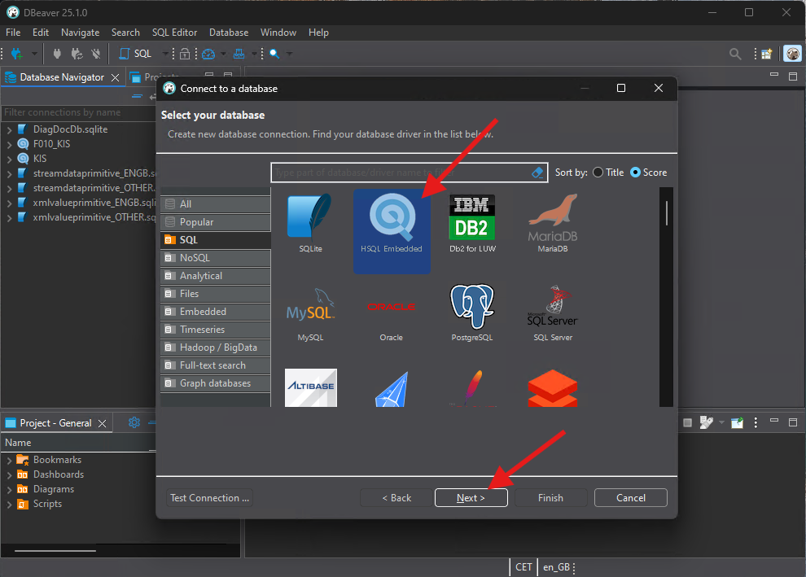
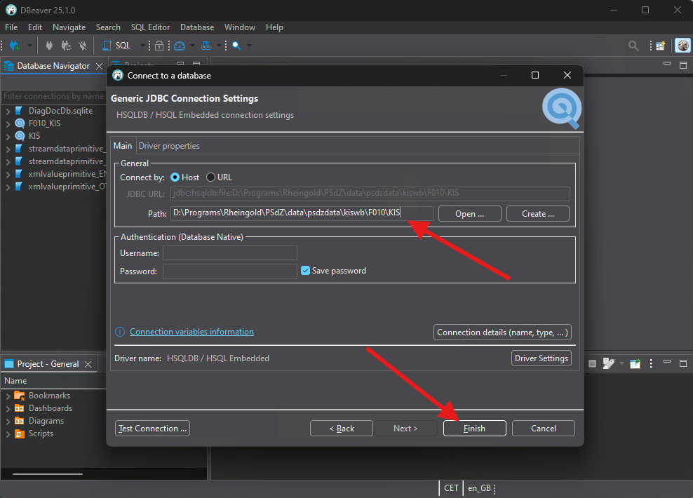

# PSdZ Data

_PSdzData_, sometimes to as service data, contains information about each vehicle family and the hardware and software that it may be running for each configuration.

The _PSdzData_ name can be divided into two parts. The first part, _PSdZ_, stands for _Programmiersystem der Zukunft_ or _programming system of the future_ in English.

## KISWB

_PSdzData_ has many many components. Inside _PSdzData_ folder structures you may find some folders named _KISWB_. The _WB_ portion of that name comes from WissensBasis that means knowledge base in English.

The files contained inside _KISWB_ are HSQL databases. These files can be opened using any HyperSQL DataBase client. Currently, my recommended tool to work with KISWB databases is [DBeaver](https://dbeaver.io/download/).

In order to open a KISWB download and install [DBeaver](https://dbeaver.io/download/). Open the program and click on the new database connection button.

From the option list select HSQL Embedded option and click on _Next_.

Select the folder path of the KISWB database you want to browse. Also, make sure you append the _KIS_ file name at the end. Clock on Finish.

You may now browse the database contents.
